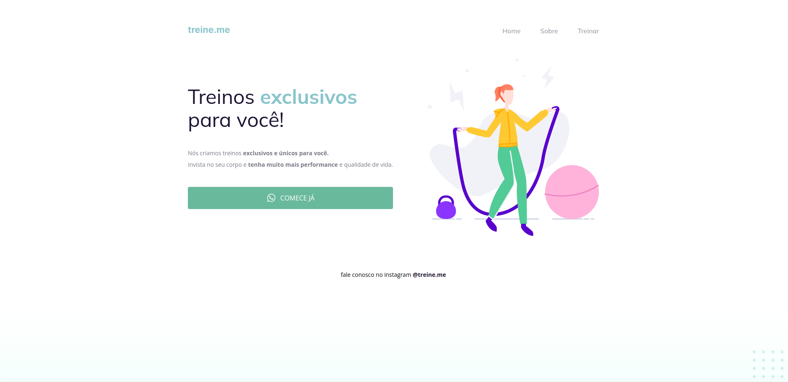

<h1 align="center"> Semântica e Acessibilidade (02) </h1>

Sabemos que a maior parte do conteúdo disponível na internet hoje pode se tornar acessível apenas com a utilização correta dos elementos do HTML. 
 
 
Você receberá um código com o projeto desenvolvido durante a Fase 02, mas, ao contrário do que foi feito em aula, ele não apresenta a semântica correta.  
Como você pode ver na imagem abaixo, a página (exceto o botão) continua funcionando normalmente mas, quando você abrir o código, vai se deparar com os elementos do HTML todos bagunçados... 👀

  

Topa encarar esse desafio e deixar o site mais acessível? 💜  
Vai ser muito importante para o seu aprendizado rever e aplicar esses novos conceitos. 
 
 
Lembrando: tente se desafiar e não olhar a resposta mas, caso apareça alguma dificuldade, você pode voltar nas aulas e rever a maneira com que foi desenvolvido!
 
 
Para facilitar, vamos deixar o link do Figma aqui pra você.

  <a href="#-tecnologias">Tecnologias</a>&nbsp;&nbsp;&nbsp;|&nbsp;&nbsp;&nbsp;  
  <a href="#-layout">Layout</a>&nbsp;&nbsp;&nbsp;

 

## 🚀 Tecnologias

Esse projeto foi desenvolvido com as seguintes tecnologias:

- HTML e CSS
- JavaScript
- Git e Github
- Figma

## 🔖 Layout

Você pode visualizar o layout desejado do desafio através [DESSE LINK] https://www.figma.com/file/rkDOHGPwwFtBNqEdHSuQPd/Projeto-02---Explorer?type=design&node-id=0-1&mode=design&t=fFtoLMkiKKy3EsM3-0. É necessário ter conta no [Figma](https://figma.com) para acessá-lo.

---

Feito com ♥ by Rocketseat :wave: [Participe da nossa comunidade!](https://discord.gg/rocketseat)
